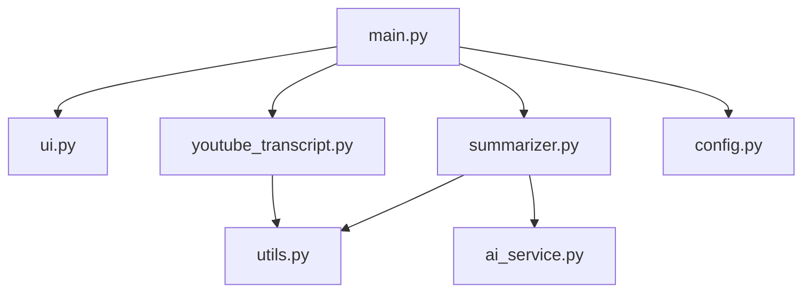

# POC 2 - Génération de résumés courts (abstracts) à partir des transcripts YouTube

## Installation de l'environnement python avec Conda

1. **Créer un environnement virtuel avec conda**
```
conda create -p ./venv python==3.12 -y
```
le `p`implique qu'il sera créé dans le dossier de travail


- **Pour l'activer**

```
conda activate ./venv
```


- **Pour installer les dépendances**
```
pip install -r requirements.txt
```


- **Si vous souhaitez le supprimer par la suite**
```
rm -rf ./venv
```


**Lancer l'app streamlit** 

```
streamlit run main.py
```


# Schéma logique :




# Explication détaillée du fonctionnement de chaque fichier :

1. **main.py**
   - Rôle : Point d'entrée principal de l'application Streamlit.
   - Fonctionnement :
     - Initialise l'interface utilisateur en appelant les fonctions de ui.py.
     - Gère le flux global de l'application.
     - Coordonne les interactions entre l'extraction du transcript (youtube_transcript.py) et la génération du résumé (summarizer.py).
   - Modifications pour le POC 2 :
     - Ajout d'un appel à la fonction de génération de résumé après l'extraction du transcript.
     - Affichage du transcript original et du résumé généré côte à côte.

2. **ui.py**
   - Rôle : Gestion des composants de l'interface utilisateur Streamlit.
   - Fonctionnement :
     - Définit les fonctions pour créer et afficher les éléments de l'interface.
   - Modifications pour le POC 2 :
     - Ajout d'une fonction pour afficher le transcript original et le résumé généré côte à côte.
     - Possibilité d'ajouter des contrôles pour ajuster la longueur du résumé.

3. **youtube_transcript.py**
   - Rôle : Gestion des opérations liées à l'extraction des transcripts YouTube.
   - Fonctionnement :
     - Contient la logique pour extraire l'ID de la vidéo et récupérer le transcript.
     - Utilise l'API YouTube Transcript.
   - Pas de modifications majeures nécessaires pour le POC 2.

4. **summarizer.py** (Nouveau fichier)
   - Rôle : Gestion de la génération de résumés courts à partir des transcripts.
   - Fonctionnement :
     - Contient la logique pour créer des résumés concis en utilisant l'IA.
     - Interagit avec ai_service.py pour accéder aux fonctionnalités d'IA.
     - Peut inclure des fonctions pour ajuster la longueur et le style du résumé.

5. **ai_service.py** (Nouveau fichier)
   - Rôle : Interface avec les services d'IA pour la génération de résumés.
   - Fonctionnement :
     - Gère les appels API vers les services d'IA (OpenAI GPT4o-mini).
     - Peut inclure des fonctions pour formater les prompts et traiter les réponses.

6. **utils.py**
   - Rôle : Fournit des fonctions utilitaires génériques.
   - Fonctionnement :
     - Contient des fonctions réutilisables dans différentes parties de l'application.
   - Modifications pour le POC 2 :
     - Ajout potentiel de fonctions utilitaires pour le traitement de texte ou la manipulation de chaînes de caractères utiles pour la génération de résumés.

7. **config.py**
   - Rôle : Gestion de la configuration de l'application.
   - Fonctionnement :
     - Charge les variables d'environnement et définit les constantes globales.
   - Modifications pour le POC 2 :
     - Ajout de variables de configuration pour les services d'IA (clés API, paramètres par défaut pour la génération de résumés, etc.).

8. **.env**
   - (non disponible sur le repo) Contient la clés API, contient le nom du modèle

```
OPENAI_API_KEY=sk-proj...
OPENAI_MODEL=gpt-40-mini
```

